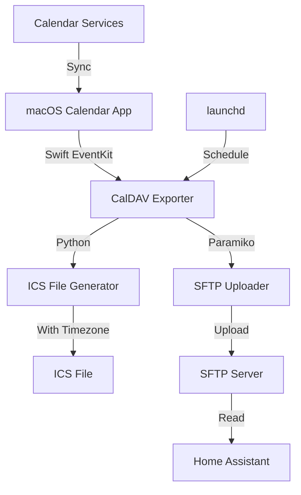

# System Patterns

## Architecture Overview



## Core Components

### 1. Calendar Access Layer (EventKit)
- Uses Swift's EventKit framework to access macOS Calendar database
- Accesses calendars synced with macOS
- Supports calendar selection by name
- Implements date range filtering
- Returns calendar events with minimal details (privacy-focused)
- Handles calendar listing for user selection

### 2. ICS Generator with Timezone Support
- Converts calendar entries to standard iCalendar (ICS) format
- Implements proper timezone handling for Europe/Berlin (CET/CEST)
- Includes VTIMEZONE components with daylight saving rules
- Ensures compatibility with Home Assistant calendar component
- Controls privacy by optionally excluding event descriptions

### 3. SFTP Upload Service
- Uses Paramiko for secure SFTP connections
- Supports both password and key-based authentication
- Handles proper path construction including remote filename
- Implements error handling for connection issues

### 4. Automated Scheduler
- Uses macOS launchd for native scheduling
- Supports configurable execution times
- Handles non-interactive execution for background operations
- Can be configured for multiple runs per day

### 5. Configuration Management
- Uses environment variables via dotenv
- Manages user preferences for calendars and date ranges
- Provides validation of configuration settings
- Supports fallback to defaults for optional settings

## Implementation Patterns

1. **Command Pattern**: Main export and upload process flow
2. **Adapter Pattern**: Swift EventKit integration with Python
3. **Builder Pattern**: For ICS file generation with timezone support
4. **Configuration Object**: For environment-based configuration management
5. **Dependency Injection**: For flexible component interactions

## Data Flow

```mermaid
sequenceDiagram
    participant User
    participant Scheduler
    participant CalendarAccess
    participant ICSGenerator
    participant SFTPUploader
    participant SFTPServer
    participant HomeAssistant

    User->>Scheduler: Configure & Start
    Scheduler->>CalendarAccess: Request Calendar Data
    CalendarAccess-->>Scheduler: Calendar Entries
    Scheduler->>ICSGenerator: Generate ICS File
    ICSGenerator-->>Scheduler: ICS File
    Scheduler->>SFTPUploader: Upload File
    SFTPUploader->>SFTPServer: Transfer ICS File
    SFTPServer-->>SFTPUploader: Upload Confirmation
    SFTPUploader-->>Scheduler: Upload Status
    HomeAssistant->>SFTPServer: Fetch ICS File
    SFTPServer-->>HomeAssistant: ICS File
    HomeAssistant->>HomeAssistant: Display Calendar
